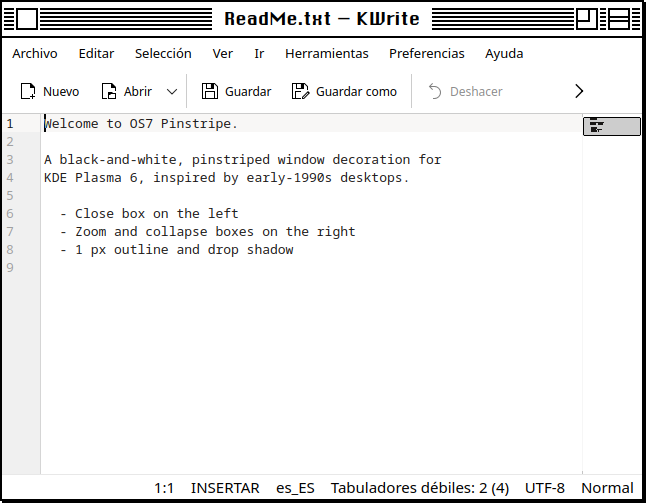
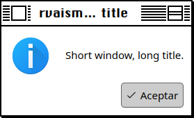
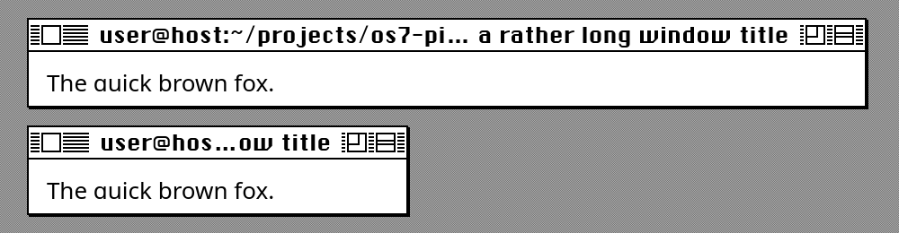
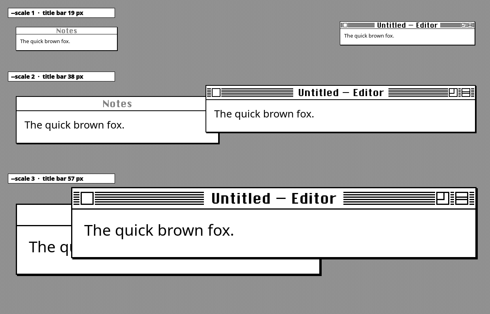
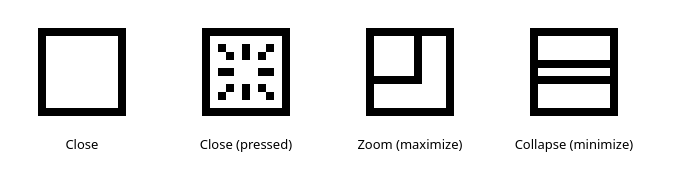
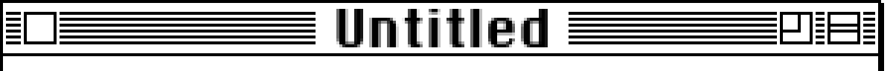

# OS7 Pinstripe

**A black-and-white, pinstriped desktop theme for KDE Plasma 6, inspired by the look of early-1990s desktop computers.**




*A real screenshot: KWrite on Fedora 44, KDE Plasma 6.7 (Wayland), `--scale 2`, QML engine. The app menus are in Spanish because that is the system language.*

---

## Table of contents

- [Features](#features)
- [Decoration engines: QML and SVG](#decoration-engines-qml-and-svg)
- [Screenshots](#screenshots)
- [Scope: what it does and what it does not](#scope-what-it-does-and-what-it-does-not)
- [Requirements](#requirements)
- [Installation](#installation)
- [Changing the size](#changing-the-size)
- [Uninstalling](#uninstalling)
- [Going further with customization](#going-further-with-customization)
- [Troubleshooting](#troubleshooting)
- [Project structure](#project-structure)
- [Legal notice](#legal-notice)
- [License](#license)

---

## Features

### Window decoration (KWin / Aurorae)

- 1 px black outline with a 1 px offset **drop shadow** on the right and bottom edges.
- Six horizontal **pinstripes** across the title bar. The centered title sits on a white plate **exactly as wide as the text**, so the stripes never touch it.
- Long titles are shortened in the middle ("…") instead of overflowing.
- **Invisible resize handles** just outside the 1 px frame, so thin borders are still easy to grab.
- Square **close box** on the left. While you hold the mouse button down on it, it shows a "burst" pattern.
- **Zoom box** (maximize / restore) and **collapse box** (minimize) on the right.
- **Inactive windows** have a plain white title bar with a gray title and no boxes.
- Three sizes are installed side by side: **×1** (19 px title bar), **×2** (38 px) and **×3** (57 px).
- Two engines: **QML** (default) and **SVG** (fallback). See [Decoration engines](#decoration-engines-qml-and-svg).

### Color scheme

- Pure black on white. Selections are inverted (white text on black).
- Applies to every KDE/Qt app and to GTK apps that use the Breeze GTK theme.

### Plasma Style

- White panel with a black edge. A top panel looks like a classic menu bar.
- Menus, popups, tooltips and desktop widgets get a 1 px outline and a 1 px drop shadow.
- Any element it doesn't define falls back to Breeze.

### Wallpapers

Three tiled 8×8 patterns:

| Name | Description |
|---|---|
| `gray` | Soft gray checkerboard (default, easy on the eyes) |
| `bw` | The classic 50 % black-and-white dither |
| `violet` | Blue-violet pattern, reminiscent of mid-90s color desktops |

---

## Decoration engines: QML and SVG

KWin's Aurorae decoration engine can load themes in two formats, and OS7 Pinstripe ships both:

| | **QML** (default) | **SVG** (`--engine svg`) |
|---|---|---|
| Title plate | Fits the title text exactly | Fixed: the middle 40 % of the title bar |
| Long titles | Shortened with "…", never touch the stripes | Can run over the stripes |
| Easy resizing | Invisible grab area outside the frame | Only the visible border (plus Plasma's minimum) |
| KWin plugin | `org.kde.kwin.aurorae` (the classic engine) | `org.kde.kwin.aurorae.v2` (the newer engine) |
| Resources | Drawn with Qt Quick (slightly heavier) | Native rendering (lightest) |
| Names in System Settings | **OS7 Pinstripe**, **×2**, **×3** | **OS7 Pinstripe SVG**, **×2**, **×3** |

Use **QML** unless you have a reason not to. If a future Plasma release drops the classic engine, the installer falls back to SVG automatically.

---

## Screenshots

### Long titles

The title plate grows with the text and the title is shortened when space runs out.

| Real screenshot (narrow dialog) | Rendered: wide vs. narrow window |
|---|---|
|  |  |

### All three sizes

Rendered with [`tools/render_previews.py`](tools/render_previews.py), using the same geometry as the QML decoration. Each row is drawn at its real pixel size.



### Title bar widgets (magnified 8×)



### Pixel pattern (scale 1, magnified 4×)



---

## Scope: what it does and what it does not

### ✅ What it does

- Replaces the **window borders and title bars** of every window that KWin decorates. This covers most KDE/Qt apps and many others.
- Applies a **black-and-white color scheme** to Qt/KDE apps.
- Restyles the **Plasma panel, menus, popups and tooltips** through a Plasma Style.
- Sets a **tiled pattern wallpaper** (optional).
- Optionally moves your panel to the **top edge** and sets a **Chicago-style title font**, if one is installed.
- **Backs up your current settings** on the first run, so `uninstall.sh` can put everything back.
- Installs only into your home folder (`~/.local/share`). It never needs `sudo`.

### ❌ What it does not do

- **It does not restyle apps that draw their own title bars** (client-side decorations): GNOME/libadwaita (GTK4) apps, Chrome/Chromium, Electron apps (VS Code, Discord, …), Firefox with its title bar hidden, Steam, etc. Those keep their own look.
- **It does not change widgets inside apps** (buttons, checkboxes, scroll bars). Those still use Breeze, only recolored. See [Application style](#application-style-widgets-inside-apps).
- **No icons, cursors, sounds, login screen or boot splash.** See [Going further](#going-further-with-customization).
- **No global menu bar.** Moving the panel to the top makes it *look* like a menu bar. To show app menus there, add the Global Menu widget yourself (see [Panel layout](#panel-layout-menu-bar-on-top)).
- **With the SVG engine only:** the white gap behind the title is not sized to the text, because SVG themes can't measure it. The gap always takes the middle 40 % of the title bar, and long titles in narrow windows can run over the stripes. The default QML engine doesn't have this problem.
- **It does not bundle any font.** See [Recommended font](#step-2-optional-install-a-chicago-style-font).
- **It is not a pixel-exact copy** of any commercial operating system, and it contains no third-party artwork. Everything is drawn from scratch by `generate.py`.

---

## Requirements

| Requirement | Notes |
|---|---|
| KDE Plasma **6.x** | Tested on Plasma **6.7.5**, Fedora 44, Wayland. X11 should work too. |
| `python3` | Standard library only. Preinstalled on Fedora. |
| `git` *(optional)* | Only needed to clone the repository. You can download a ZIP instead. |
| `python3-pyside6` *(optional)* | Only needed to regenerate the README previews. |

---

## Installation

### Step 1: Download

**Option A: with git**

```bash
git clone https://github.com/rvaisman/os7-pinstripe.git
cd os7-pinstripe
```

**Option B: without git**

1. On the repository page, click **Code → Download ZIP**.
2. Extract it and open a terminal in the extracted `os7-pinstripe-main` folder:

```bash
cd ~/Downloads/os7-pinstripe-main
```

### Step 2 (optional): Install a Chicago-style font

The title bars look best with a bitmap-style font similar to the one used on early-90s desktops. **ChicagoFLF** is a free font that has been widely redistributed for decades. Find a copy, check its license yourself, and install it for your user:

```bash
mkdir -p ~/.local/share/fonts
cp ChicagoFLF.ttf ~/.local/share/fonts/
fc-cache -f
```

The installer detects **ChicagoFLF** automatically and sets it as the window title font, sized for the scale you choose. If the font isn't installed, your current title font stays as it is.

### Step 3: Run the installer

```bash
./install.sh
```

This installs every part and applies it right away: decoration at scale 2, color scheme, Plasma Style and the gray wallpaper. Your current settings are saved first in `~/.local/share/os7-pinstripe/backup.env`.

#### Installer options

| Option | Description |
|---|---|
| `--scale 1\|2\|3` | Title bar size: `1` = 19 px (original proportions), `2` = 38 px (**default**, good for 1080p), `3` = 57 px (4K) |
| `--engine qml\|svg` | Decoration engine: `qml` (**default**, title plate fits the text) or `svg`. See [Decoration engines](#decoration-engines-qml-and-svg) |
| `--wallpaper NAME` | `gray` (default), `bw`, `violet` or `none` (keep your wallpaper) |
| `--panel-top` | Move your panel(s) to the top edge, like a menu bar |
| `--no-font` | Don't touch the window title font |
| `--copy-only` | Only copy the files. Nothing is applied, so you pick each part yourself |
| `-h`, `--help` | Show the help |

Examples:

```bash
# Original size, classic black-and-white dither, panel on top
./install.sh --scale 1 --wallpaper bw --panel-top

# Only the window decoration and colors; keep my wallpaper and font
./install.sh --wallpaper none --no-font
```

### Alternative: pick the parts in System Settings

Run `./install.sh --copy-only`, then choose each part in **System Settings**:

| Part | Where |
|---|---|
| Window decoration | *Colors & Themes → Window Decorations* → **OS7 Pinstripe**, **OS7 Pinstripe ×2** or **OS7 Pinstripe ×3** (QML). The **OS7 Pinstripe SVG** entries are the fallback engine |
| Button layout | Same page → *Configure Titlebar Buttons…* → put **Close** on the left and **Maximize** and **Minimize** on the right |
| Colors | *Colors & Themes → Colors* → **OS7 Pinstripe** |
| Plasma Style | *Colors & Themes → Plasma Style* → **OS7 Pinstripe** |
| Wallpaper | Right-click the desktop → *Desktop and Wallpaper…* → add an image from `~/.local/share/wallpapers/OS7Pinstripe/` and set *Positioning* to **Tiled** |
| Title font | *Text & Fonts → Fonts → Window title* |

---

## Changing the size

Run the installer again with another scale:

```bash
./install.sh --scale 3
```

Or switch between **OS7 Pinstripe**, **×2** and **×3** in *System Settings → Window Decorations*. The installer also adjusts the title font size: 13, 18 or 26 pt.

> [!NOTE]
> Only whole-number scales are offered. With a fractional scale, the 1 px stripes would be smoothed into gray.

---

## Uninstalling

```bash
./uninstall.sh
```

This restores your previous window decoration, button layout, title font, color scheme, Plasma Style, wallpaper and panel position from the backup, and then deletes the theme files.

---

## Going further with customization

### Tweaking the theme itself

The QML decoration lives in [`src/decoration/`](src/decoration). Everything else is generated by [`generate.py`](generate.py). Edit the files, then reinstall:

```bash
python3 generate.py && ./install.sh
```

| What | Where |
|---|---|
| QML: stripes, title plate padding, button positions, resize handles | [`src/decoration/main.qml`](src/decoration/main.qml). All sizes are multiples of `u` (the scale) |
| QML: box artwork (close, zoom, collapse, pressed burst) | [`src/decoration/PinstripeButton.qml`](src/decoration/PinstripeButton.qml) |
| SVG: width of the white gap behind the title | `GAP = (0.30, 0.70)` in `generate.py` |
| SVG: number and position of the stripes | `STRIPE_ROWS` in `generate.py` |
| SVG: title bar height and button layout | `TOP_H` and `aurorae_rc()` in `generate.py` |
| Button order | *System Settings → Window Decorations → Configure Titlebar Buttons…*. The installer puts Close on the left and Maximize and Minimize on the right |
| Colors | `colors_file()` |
| Panel and popup outlines, shadows and margins | `build_plasma_style()` |
| Wallpaper patterns | `build_wallpapers()` |

> [!IMPORTANT]
> KWin keeps each decoration's geometry in memory. After you change sizes in `generate.py` and reinstall, **log out and back in** to see the new geometry. Colors and artwork usually refresh right away.

### Panel layout (menu bar on top)

For a classic look:

1. Run `./install.sh --panel-top`, or right-click the panel → *Show Panel Configuration* → *Position: Top*.
2. Add the **Global Menu** widget, so the menus of the focused app appear in the panel.
3. Put the **Application Launcher** on the far left and give it a custom icon (right-click → *Configure*).
4. Put the **Digital Clock** on the right.
5. If you want a dock, add a second panel at the bottom with the **Icons-only Task Manager**.

### Fonts

In *System Settings → Text & Fonts*:

- **General / Menu / Toolbar:** a Chicago-style font at 12 pt for a strong retro look. A small, clean sans also works.
- **Fixed width:** a pixel monospace font for terminals and editors.
- Turn off anti-aliasing (*Anti-Aliasing: Disabled*) for crisp bitmap-like text. This affects every app.

### Application style (widgets inside apps)

The color scheme recolors Breeze, but buttons and scroll bars keep the Breeze shapes. For square, outlined widgets:

```bash
sudo dnf install kvantum
```

Then open **Kvantum Manager**, install a retro or Platinum-style Kvantum theme from the KDE Store, and select **kvantum** in *System Settings → Colors & Themes → Application Style*.

### GTK apps

In *System Settings → Colors & Themes → Application Style → Configure GNOME/GTK Application Style…*, keep **Breeze** so GTK3 apps follow the OS7 Pinstripe colors. GTK4/libadwaita apps ignore most theming.

### Icons, cursors and sounds

Use the **Get New…** buttons in *System Settings*:

- **Icons:** search for retro, pixel or 1-bit icon themes.
- **Cursors:** search for black-and-white pixel cursor themes.
- **Sounds:** *Notifications → Configure* lets you assign short retro sounds to system events.

### Login screen and splash

- *Colors & Themes → Login Screen (SDDM)*: choose a plain theme and set a pattern as its background.
- *Colors & Themes → Splash Screen*: choose **None**, or a minimal splash.

### Want platinum gray instead?

If you prefer the look of the late-90s *platinum* desktops, search the KDE Store for Platinum-style Aurorae themes and global themes. They complement this theme well.

---

## Troubleshooting

<details>
<summary><b>I changed generate.py, reinstalled, and the title bar size didn't change</b></summary>

KWin caches the geometry of each decoration until you log out. Log out and back in. As a quick test, you can also switch to another scale (×1, ×2 or ×3); each one is a separate theme.
</details>

<details>
<summary><b>The side borders look thicker than 1 px (SVG engine)</b></summary>

With the SVG engine, Plasma enforces a minimum border width that depends on *System Settings → Window Decorations → Window border size*. With **Normal**, the minimum is 4 px, so the black outline stays 1 px with a white inner margin. Choose **Tiny**, or use the default QML engine, which always draws exact 1 px borders.
</details>

<details>
<summary><b>Some apps still have their own title bars</b></summary>

Those apps draw their own title bars (client-side decorations). Examples are GNOME/libadwaita apps, Chrome, Electron apps and Steam. A KWin theme can't change them. Some of these apps have a setting to use the system title bar. In Chrome, for example: right-click the tab strip → *Use system title bar and borders*.
</details>

<details>
<summary><b>The title runs over the stripes</b></summary>

You are using the SVG engine. Reinstall with the default QML engine (`./install.sh`), or pick **OS7 Pinstripe** (not the "SVG" entries) in *System Settings → Window Decorations*.
</details>

<details>
<summary><b>The window is hard to resize with such thin borders</b></summary>

With the QML engine, you can start resizing a few pixels *outside* the visible frame. You can also hold **Meta** (the Windows key) and drag with the **right** mouse button anywhere in the window, or press **Alt+F8**.
</details>

<details>
<summary><b>Window decorations disappeared or fell back to Breeze after a Plasma update</b></summary>

A future Plasma release might remove the classic Aurorae engine that QML themes need. Run `./install.sh --engine svg` to switch to the SVG engine.
</details>

---

## Project structure

```text
os7-pinstripe/
├── src/
│   └── decoration/          # QML window decoration (main.qml, PinstripeButton.qml)
├── generate.py              # Builds every theme file into ./build (stdlib only)
├── install.sh               # Copies to ~/.local/share, backs up and applies settings
├── uninstall.sh             # Restores the backup and removes the files
├── tools/
│   └── render_previews.py   # Renders docs/screenshots/*.png (PySide6)
├── docs/
│   └── screenshots/         # Images used in this README
├── LICENSE
└── README.md
```

Generated output (`build/`, not committed):

```text
build/
├── kwin-decorations/os7pinstripe{,-2x,-3x}/  # QML decoration packages
├── aurorae/OS7Pinstripe{,-2x,-3x}/   # SVG decoration: decoration.svg, button SVGs, <id>rc
├── color-schemes/OS7Pinstripe.colors
├── desktoptheme/OS7Pinstripe/        # Plasma Style: panel, dialogs, tooltips, widgets
└── wallpapers/pattern-{gray,bw,violet}.png
```

---

## Legal notice

OS7 Pinstripe is an independent fan project. It is **not affiliated with, endorsed by or sponsored by Apple Inc.**

Apple, Macintosh, Mac OS and System 7 are trademarks of Apple Inc. They are mentioned only to describe the visual style that inspired this theme. The theme contains **no Apple artwork, fonts, icons or code**. Every graphic is generated from simple shapes by `generate.py`, and no fonts are bundled.

---

## License

[GPL-3.0](LICENSE).
